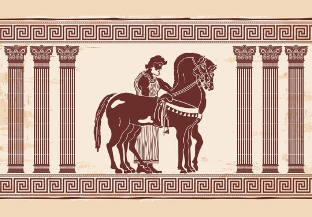

# Hermes Express

> "[Hermes] The herald of the gods, the swift messenger of Zeus, came from the sky and stood before
> her."
>    — Homer, The Odyssey

Hermes Express is a personal project that showcases how to build a delivery Android application
using state-of-the-art technologies in Android development. The app enables bikers to explore
delivery offers and accept one to fulfill. Using modern Android development technologies (listed in
the [Technologies](#Technologies) section below), Hermes Express provides a practical example of
creating a reliable, scalable, and user-friendly app in the delivery domain.

## Technologies

### Architecture

- [Modular](https://developer.android.com/topic/modularization) by both feature and layer (feature
  and core directories)
- MVVM + [UDF](https://developer.android.com/jetpack/compose/architecture#udf) state management in
  the presentation layer
- Reactive style using [Coroutine Flow](https://kotlinlang.org/docs/coroutines-overview.html)
- [Koin](https://insert-koin.io/) for Dependency Injection
- [Jetpack Navigation Compose](https://developer.android.com/jetpack/compose/navigation)

### I/O

- [FCM](https://firebase.google.com/docs/cloud-messaging) for cloud messaging
- [Retrofit](https://square.github.io/retrofit/) for HTTP request
- [Kotlin Serialization](https://kotlinlang.org/docs/serialization.html)

### Map

- [MapBox Android SDK](https://docs.mapbox.com/android/maps/guides/)
- Jetpack Compose wrapper around MapView with UDF state management

### Build

- [Gradle composite build](https://docs.gradle.org/current/userguide/composite_builds.html) for
  encapsulating build logics
- [Gradle Convention Plugins](https://docs.gradle.org/current/samples/sample_convention_plugins.html)
  for sharing build logic between subprojects
- [Version Catalog](https://docs.gradle.org/current/userguide/platforms.html) for sharing dependency
  versions between subprojects
- [Detekt](https://detekt.dev/) static analyzer for finding code smells

### UI

- Compose UI
- Material 3 design system with support
  for [dynamic color](https://m3.material.io/styles/color/dynamic-color/overview) (Android 12+)
- [Themed launcher icon](https://developer.android.com/develop/ui/views/launch/icon_design_adaptive#user-theming) (
  Android 13+)

License
--------

    Copyright 2023 Ali Bagherifam

    Licensed under the Apache License, Version 2.0 (the "License");
    you may not use this file except in compliance with the License.
    You may obtain a copy of the License at

       http://www.apache.org/licenses/LICENSE-2.0

    Unless required by applicable law or agreed to in writing, software
    distributed under the License is distributed on an "AS IS" BASIS,
    WITHOUT WARRANTIES OR CONDITIONS OF ANY KIND, either express or implied.
    See the License for the specific language governing permissions and
    limitations under the License.
